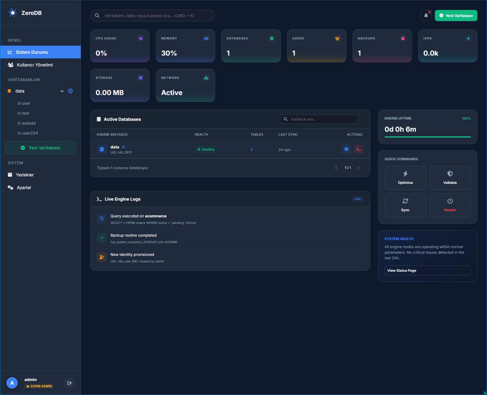

## ✅ ZeroDB Admin UI Deveploment
 * The new admin ui webside is still in development.

---

---

# ZeroDB Admin UI Standartları (v1.0)

## 1. Renk Paleti (CSS Değişkenleri)
- **Background (Dark):** `#0f172a` (Ana arka plan)
- **Card Background:** `rgba(30, 41, 59, 0.7)` with `backdrop-filter: blur(20px)`
- **Primary (Blue):** `#3b82f6` (İşlem butonları, aktif durumlar)
- **Success (Green):** `#10b981` (Onay, yeni oluşturma, sağlıklı durum)
- **Error (Red):** `#ef4444` (Silme, hata mesajları)
- **Text White:** `#f8fafc`
- **Text Muted:** `#94a3b8`
- **Border:** `rgba(255, 255, 255, 0.08)`

## 2. Tipografi
- **Font Family:** 'Inter', sans-serif (Google Fonts)
- **Headers:** Font-weight 800 (Bold)
- **Labels:** Font-weight 700, font-size 11px, Uppercase, 1px Letter-spacing

## 3. Bileşen Standartları

### A. Kartlar (Cards)
- **Border-radius:** `20px` veya `24px`
- **Shadow:** `0 10px 30px rgba(0,0,0,0.2)`
- **Padding:** Standart `30px`

### B. Butonlar (Buttons)
1. **Primary Button (`.btn-primary`):** 
   - Gradient: `linear-gradient(135deg, var(--primary), #2563eb)`
   - Border-radius: `12px` veya `14px`
   - Hover: `translateY(-2px)` ve artırılmış gölge.
2. **Success Button (`.btn-success`):**
   - Gradient: `linear-gradient(135deg, #10b981, #059669)`
3. **Outline Button (`.btn-outline`):**
   - Background: Transparent
   - Border: `1px solid var(--border)`

### C. Form Elemanları (Inputs & Selects)
- **Klas Adı:** `.modern-input`
- **Stil:** Koyu arka plan (`rgba(15, 23, 42, 0.8)`), 1px solid border.
- **Focus:** `border-color: var(--primary)`, `box-shadow: 0 0 0 4px rgba(59, 130, 246, 0.1)`
- **Geçiş (Transition):** `border-color 0.2s, box-shadow 0.2s` (İlk açılışta parlamayı önlemek için 'all' kullanılmamalı).
- **Select Option:** Arka plan rengi `#1e293b` olarak sabitlenmelidir.

### D. Durum Göstergeleri (Status Pills)
- **Badge:** Oval (`border-radius: 100px`), düşük opaklıklı arka plan, canlı metin rengi.
- **Status Dot:** Parlama (glow) efektli animasyonlu noktalar.

## 5. Modern Alpha Tasarım İlkeleri (Yeni)

Yeni eklenen bu standartlar, sistemin daha profesyonel ve "high-tech" görünmesini sağlar.

### A. Alpha Butonlar (Alpha Buttons)
Geleneksel solid butonlar yerine, düşük opaklıklı arka plan ve canlı metin rengi kombinasyonu kullanılmalıdır.
- **Primary Alpha (`.btn-alpha-primary`):** 
  - Background: `rgba(139, 92, 246, 0.1)` (Mor tabanlı)
  - Color: `#a78bfa`
  - Border: `1px solid rgba(139, 92, 246, 0.2)`
- **Danger Alpha (`.btn-alpha-danger`):**
  - Background: `rgba(239, 68, 68, 0.1)`
  - Color: `#f87171`
  - Border: `1px solid rgba(239, 68, 68, 0.2)`
- **Info Alpha (`.btn-alpha-info`):**
  - Background: `rgba(59, 130, 246, 0.1)`
  - Color: `#60a5fa`
  - Border: `1px solid rgba(59, 130, 246, 0.2)`

### B. Custom Dropdown Sistemi
Standart HTML select elemanları yerine tamamen CSS ile stilize edilmiş dropdown yapıları tercih edilmelidir.
- **Arka Plan:** `#1e293b`
- **Seçenekler (Options):** Hover durumunda `rgba(59, 130, 246, 0.1)` arka plan ve beyaz metin.
- **İkonlar:** Her seçenek mutlaka anlamlı bir Font Awesome ikonu içermelidir.

### C. Layout & Architect Yapısı
Karmaşık formlar ve yapılandırma sayfaları "Architect" düzenini kullanmalıdır:
- **Hero Area:** Sayfanın en üstünde, breadcrumb içeren ve sayfa amacını belirten degrade (gradient) arka planlı alan.
- **Split Layout:** Sol taraf (Geniş) ana form/editör alanı, sağ taraf (Dar) anlık önizleme (Live Preview) ve yardımcı araçlar (Tip Box) alanı.
- **Live Preview:** Yapılan değişiklikler sağ paneldeki `code-block` içinde anlık JSON formatında gösterilmelidir.